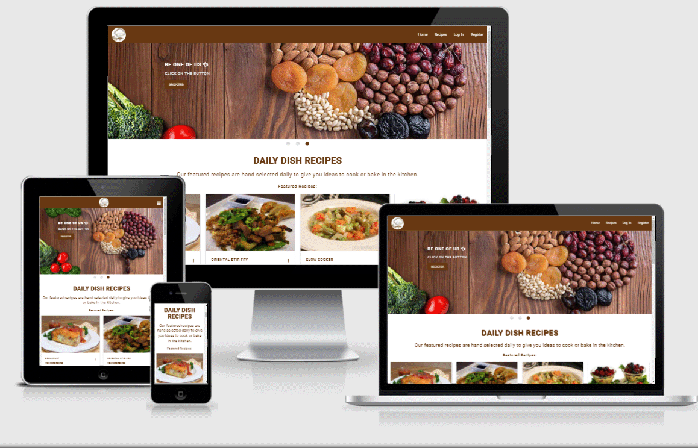

 Delicious Cook Book

 
 
<h1 align="center"><a href="https://delicious-cookbook.herokuapp.com/" target="_blank">Look At The Best International Recipes Here</a></h1>

# General Information
### A website **Delicious Cook Book **: 
 Has been created with the latest technologies and programming languages ​​in order to provide everyone who loves to eat and cook and learn about the latest and best international meals. It is unparalleled fun. In addition, it allows the user to share his favorite recipes with us and publish it in front of the public, and it is also easy to use and publish. The user is provided with clear facilities of how to publish his recipe through this website that can be displayed on different device sizes of computers...laptops...and different mobile devices.

# Website business goals:
  - Establishment of a global brand in the field of cooking.
  - Create an electronic cookbook that is world famous by containing the latest international recipes from all countries of the world.
  - Attract visitors to our book through the site's social media.
  - The user of the site makes it easy for him to publish his favorite recipe and spread it globally.
  - The user is patient famous in the field of cooking through our website.

# Scope
This is the **Third project** as it relies on the latest technologies and programming languages, making the site more interactive and easier to deal with users, and this is the main goal of it... The project consists of **HTML 5**, **Stylesheet CSS**, **Jquery**, **Python language** and the latest libraries, including That's **Flask**, linked to a solid database, which is **MongoDB** and linked to better software tools. It allowed and facilitated for me to run reliable and repeatable tests for every deployment. Integration with **Herkou CI/CD** makes me fast, flexible and efficient.

# User Experience
## User stories
### As a **New Visitor**:
  - I want to understand the content and purpose of the site with great flexibility
  - I want to navigate the pages of the site easily to understand the content and reach my goal
  - I want to have a website that can be browsed easily and clearly with different sizes of electronic devices, which makes me want to visit the site frequently
  - I want to browse all the recipes published on the site with pleasure through the pictures, colors and fonts used on the site by the programmer
  - I want to search for my favorite recipe through an electronic searcher easily and easy to access the required recipe using the recipe keywords.
  - The visitor's interest in seeing an integrated and comprehensive site for all the information.
  - I would like to see a site that contains different pictures of the most important global recipes, which may attract my attention and increase my desire to visit this site and learn about the backward countries through their food

### As a **Frequent Visitor**:
  - I want to find in the site an easy-to-use electronic search engine that will allow me to reach my goal smoothly.
  - As a visitor of food and cooking, I want to find the most important and newest recipes.
  - I want to communicate directly with the site and receive all that is new and new through the site's social media.
  - I want to create an account for me easily.
  - I want to be able to add my favorite recipe on the site and publish it to the public with great aesthetics.
  - I want to be able to delete my old and unused recipes for a long time.
  - I want to be able to easily update my new recipes.
  - I want to easily navigate the site and browse the posted recipes.
  - I would like to have the access to change, edit or delete the recipe I created, and no other visitor can manipulate my recipes.
  - I want to become famous through this site and thus reach my goal in the world of cooking and fame by owning the recipe and putting my name on it.
  - I want to browse the site in different sizes smoothly.
  - I want to find the most famous recipes in the world through this site.

# Design
## Colour Scheme
This site has been created on two main colors, **brown and white**, because they are directly and fundamentally related to all the recipes published on the site, and these two colors have been relied upon for several reasons including:

    1. It is comfortable for the eye, which attracts the visitor to browse the site with a strong desire.
    2. It is inspired by the color of chocolate, which is mainly used in most recipes, especially sweets. 
    3. Finally, it has to do with the loco that was placed at the top of the page.

As for the **orange** color that was added at the end of the pages in the foot, which is to increase the aesthetics of the site.

We have used two other colors in the buttons, which are the **green color** to allow & add something, and the **red color** to alert in the event of deleting or erasing something.

### The color palette is:
  - #683b12
  - #fff
  - #00c853
  - #b71c1c

## Typography
  - **Roboto font**: Is the main font used throughout the site with **Sans Serif** as the backup font In case the font isn't imported properly into the site for any reason from the google fonts, this font that I've used on all my pages is nice and clean font that's frequently used in programming, so it's attractive and appropriate.
  - The source for the inspired font is [Google Fonts](https://fonts.google.com/)

## Wireframe
  - All wireframes pages were created by mockflow-wireframe.I made a simple and concise layout of all pages in the project, which are **Home, Recipes, Login, Register, Add recipe, and Manage Category**.
  
### The website is divided into three parts:
  1- For the general public where they can see and navigate between 4 pages only(Home, Recipes, Log In, Register)

  [View the Home, Recipe and register wireframes](static/files/Wireframes-ms3.pdf)
 
  [View the Login-page wireframe](static/files/login-wireframe.pdf)

  2- For users who have a personal account on our site, they have more privileges and possibilities in terms of adding, modifying and deleting the recipe, and here Create, Read, Update, and Delete **(CRUD)** which are the four functions takes place,they can navigate in addition to the four pages  Home, Recipes, Login, Regiter mentioned above they can see **Add recipe** and thier **Profile page**.

  [View the add recipe and edit recipe wireframes](static/files/add-edit-recipe-wireframs.pdf)
 

  [View the add recipe and edit recipe wireframes](static/files/profileandrecipe-page.pdf)

  3- For the admin, where he can see, navigate and control all pages including creation, modification and deletion of the categories page.

  [View admin wireframes](static/files/admin-pages.pdf)

## Imagery
Pictures of food recipes have been acquired from various sites.
The idea for the logo was gained during the search process in Google.
Large images have been placed in the front of the home page with the help of Materialize Slider.
Examples of sites:

 [Whatmollymade](https://whatmollymade.com/)

 [Unsplash](https://unsplash.com/s/photos/man-proudkter)

 [Google](https://www.google.com)

# Technologies
## Languages Used:

  - [HTML5](https://en.wikipedia.org/wiki/HTML5)
  - [CSS3](https://en.wikipedia.org/wiki/CSS)
  - [Jquery](https://en.wikipedia.org/wiki/JQuery)
  - [Python](https://www.python.org/)
  - [Flask](https://en.wikipedia.org/wiki/Flask_(web_framework)) 
  - [Jinja](https://jinja.palletsprojects.com/en/3.0.x/)

## Frameworks, Libraries & Programs Used:
  - [Google Fonts](https://fonts.google.com/) : Google fonts were used to import the “Roboto” font into the style.css file which are used in all the website pages.
  - [Font Awesome](https://fontawesome.com/): Used to add icons to every recipe added to location and to footer of the website.
  - [Materialize 1.0.0](https://materializecss.com/):Materialized was used to assist with the responsiveness and styling of the website.
  - jQuery : used to
    - Make the navigation bar responsive.
      - $(".sidenav").sidenav()
    - Manibulate the slider which used for hero image in the front of the home page.
      -  $(".slider").slider()
    - To show the copy right date.
      -  $(".copyright").text(new Date().getFullYear())
    - Implement time picker.
      - $(".timepicker").timepicker()
    - To actions icons we can use a tooltip to give people clarification on its function.
      - $(".tooltipped").tooltip()
    - Used to manipulate Html select element.
      - $("select").formSelect()
    - Used to add Modal in Html button for dialog boxes and confirmation messages.
      -  $(".modal").modal()
    - ValidateMaterializeSelect() function.
  - [Git](https://git-scm.com/) : Git was used for version control by utilizing the Gitpod terminal to commit to Git and Push to GitHub.
  - [GitHub](https://github.com/): GitHub is used to store the projects code after being pushed from Git.
  - [GitPod](https://gitpod.io/): GitPod was used as an IDE to develop a project. A project was built on a gitpod template of the Code institute.
  - [Mockflow wireframe](https://mockflow.com/) : Used to create the wireframe pages.
  - [Paint](https://microsoft_paint.sv.downloadastro.com/): I have used Paint image and photo editing software to crob and resize the Pr scr images.
  - [Photoshop](https://www.photoshop.com/en): Used to covers images sizes.
  - [Heroku](https://www.heroku.com/): Heroku was used a hosting for the project deployment.
  - [MongoDB](https://cloud.mongodb.com/): The most popular database for modern apps Used to host the project data.

## Database (MongoDB) structure
•	The database **delicious_cookbook** consists of three collections: **Categories**, **Recipes** and **Users**.
  1. Categories Structure
     - _id - ObjectId (created by mongoDB)
     - category_name(string)
  2. Recipes Structure
     - _id - ObjectId (created by mongoDB)
     - category_name(String)
     - recipe_name(String)
     - recipe_description(String)
     - ingredients(Array)
     - instructions(Array)
     - prep_time(Number)
     - cooking_time(Number)
     - serves(Number)
     - created_at(Timestamp)
     - updated_at(Timestamp)
     - is_veg(Boolean)
     - image(String)
     - author(String)
  3. Users Structure
     - _id - ObjectId (created by mongoDB)
     - first_name(String)
     - last_name(String)
     - username(String)
     - e_mail(String)
     - password(String)-(werkzeug.security.generate_password_hash,werkzeug.security.check_password_hash)

# Features
## The Website is summarized to:
  - The site consists of 4 pages for all the audience:
    - Home, Recipes(Each recipe has its own page), Log In, Register
  - And 3 pages, which available only for registered users Profile, Add recipe and Edit recipe.
  - And 3 pages available only for admin manage category, add category,edit category.
### Base page:
The base page includes two main HTML things, the**header** and the **footer**:
1. Header: where it consists of a navigation bar and with the help of the materials I have used Mobile Collapse Button  and it was run (installation)with the help of JQuery. The navbar consist of Logo which put on the right side and four main pages which can seen on the left side which is Home, Recipes, Log In and Register this menu will turn into a clearly defined hamburger menu in the small devices and this navbar will appear in all hotmail pages on the screen with the help of Jinja which is a fast, expressive, extensible templating engine.
by exensible cood  and 
The benefit of the navigation bar is to put links to all the pages that have been created in the site, allowing the user to move between the pages smoothly.

2. Footer: The Footer includes the name of the cookbook on which the site was built, and you can click on it to go to the top of the page easily. I added active links to social networking pages which currently, social media links lead to the homepage of the particular social media sites. It also has a dynamic copyright caption. Which updates the year, based on the current date and with the help of this cood:
    - $(".copyright").text(new Date().getFullYear());

### Home page (def home() function) In python file:
The Home page which consists of several parts and these are Slider-images, Feature recipes, Main course-rated-recipes, Dessert-rated-recipes, Lastest-recipes:
  - Slider-images:The sliders were used in the interface of the page as large images expressing the content of the site, and in each picture includes a link to a specific page to encourage the visitor to become part of our team and also encourage him to add his favorite recipes and the slider was created by Materialize. This section is responsive depending on a screen size by useing Materialize grid system.

  - Feature recipes: Our featured recipes are hand selected daily to give the visitor ideas to cook or bake in the kitchen.Each recipe has a link to the corresponding recipe page for take a look about a recipe with more instructions, this section has been used Materialize grid system.

  -  Main course-rated-recipes and Dessert-rated-recipes: In this field, immutable static images have been placed to display the most important and most famous international recipes.and this section is concisely and responsive depending on a screen size by useing Materialize grid system.

  - Lastest-recipes: In this part, it has been practically linked to the get_recipe Function py Python and Flask, as it displays the last 4 recent recipes that have been added to the site and changes whenever a new recipe is added. All these data stored in the MonogDB.and this section is made with Materialize grid system to be concisely and responsive depending on a screen size.

    -  [view the home page](https://delicious-cookbook.herokuapp.com/)

### Recipes page ((def recipes() function)) In python file:
Here all the recipes added to the site are displayed by all members of the site who have a private account for each person. The recipe is displayed in the form of a card-reveal by Materialize. In this card, most of the recipe details have been placed with the recipe-image from its recipe name..to which category it belongs..the duration of preparing the recipe..duration Cook the recipe...for you, the quantity of the recipe is sufficient...Describe the recipe by added the class activator to an element inside the card to allow it to open the card reveal. Each recipe includes the name of its owner, i.e. its author. There is a link in the buttom right side of the card which can click on it and open a new recipe side which it includes all the information about this recipe, including its ingredients, as well as the way to make the recipe with its steps.
and this section is made with Materialize grid system to be concisely and responsive depending on a screen size.

  - [view the recipe page](https://delicious-cookbook.herokuapp.com/recipes)

#### Search (def search()) in python file:
 Through this searcher, you can search for the required recipe either by the name of the recipe or one of the words used in the description of the recipe, and then the recipe will be displayed if founded, by retrieving all the information from the database, and if the recipe is not found, a message will appear to the user Apologies for not being able to find the recipe.

### Register page (def register() function in pyhton file):
The registration page is a page consisting of a form to fill in the data required by the registrant so that he/she can become a member of our site, and this data is filled out with specific conditions and fields,all required.
After registration, the registrant will go to his or her personal page(Profile page). Through this page, the registrant will be able to implement the CRUD operations **Adding a recipe .. Editing the recipe ... reading the recipe and also Deleting it** All recipes added by this user will be displayed in His profile page in addition to displaying it to the public on the public recipes page, in addition to any recipe that will be added to the site will be stored in the database**MongoDB**.and this page is made with Materialize grid system to be concisely and responsive depending on a screen size.

[view registration page](http://delicious-cookbook.herokuapp.com/register)

### Log In page(def login() function in python file):
On this page, where it includes a form filled out correctly by users who have registered on the site by authenticating the entry of their personal page and the implementation of the following actions where they can see the list of recipes added to the site by them. Add recipes to the site / edit and delete recipes added by themselves.Any data that is changed by the user himself is stored directly in the database and this page is made with Materialize grid system to be concisely and responsive depending on a screen size.

[view Login page](http://delicious-cookbook.herokuapp.com/login)

### Profile page(def profile() function in python file):
This page:
  - **for a new user** will be shown to him at the top of the page. Welcome the user by calling the username from the database and displaying it on his profile page with appreciation.
At the bottom of the welcome there is a button, which is a button to add new favorite recipe by the user when click on the button will navigate the user (redirect to add_recipe page)
#### Add recipe page (def add_recipe()function in python file):
It is a page in the form of a form. All fields visible to the user must be filled in, as they are all required. This form consists of .
   1. **Select the category** by Materialize Select which allows user input through specified options.
   2. **the name of the recipe** (recipe_name which created in the recipes database collection).
   3. **the description of the recipe** (recipe_description in the recipes collection DB)
   4. **the time to prepare** (prep_time in MongoDB recipes collection)
   5. **the time to cook** (cooking_time in MongoDB recipes collection)
   6. **Ingredients** required in the recipe which stored in(ingredients MongoDB recipes collection)
   7. **Instructions** recipe preparation steps(instruction in MongoDB recipes collection)
   8. **Serves** (serves in recipes collection DB) which descripe how many person is enough in this recipe 
   9. **Created at** (created_at in recipes collecion) is timestamp which shown to the user when ites created based on the current time with help of the bellow module.
   10. **Updated at** (updated_at in recipes collection) is a timestamp Which updates the time, based on the current updated time and with the help of this import datetime in the python file.

       - from datetime import datetime
         -  "created_at": datetime.now()
         -  "updated_at": datetime.now()

   11. And finally, add an **image url** to this recipe if founded.
   12. **Is vegan** is a choice (swich) in the end of the form for user whether the person is a vegetarian or not.(located in recipes collection)

Finally, a button to add the recipe on the user's page and also on the recipes page to show it to the public.

  - **For a frequent user** : This page renders all the recipes made by particular user from database and display them on the Profile page.
  
  - **For all users**: appeare the regard message and the same button to add the new favorite recipes.
  - **In the profile page** after the user has been added a recipe this recipe will apeare as a Materialize card on the profile page and this section is made with Materialize grid system to be concisely and responsive depending on a screen size. Every card display recipe image, the recipe name, recipe description, preperation time, cooking time and serves. These data retrieved from MongoDB. There are 3 buttons on the bottom of every card: View recipe, edit and delete. 
   1. View recipe button link to the particular **recipe_detail** page:
   which هt is the page that shows all the recipe information after retriving all the data from the database and showing it on the screen.This section is made with Materialize grid system to be concisely and responsive depending on a screen size.
   2.	Edit recipe button redirect to the **edit-recipe** page (def edit_recipe() in python file):
   This page will show the same form that was filled out during the creation of a new recipe in the **ADD NEW RECIPE** page with showing all its old data to be modified and stored in the database again after modification to the data by the user himself. At the bottom of this page there are two buttons,
     - Edit Recipe: click on if the user want to Send edit data after that will redirect to (edit_recipe) page and appeare a message the shown the recipe has been updated succssfully.
     - Cancel: click on in the event of retracting his/her opinion on changing the old data.Then redirect to the (resipes page).
   3.	Delete button allows to delete the recipe from database by useing Materialize modal which Used a modal for dialog boxes, confirmation messages to ask the user if he/she sure want to delete a recipe.

## There are the last 3 pages for admin which are:
  - **Manage Category**(def get_categories() function in python file):
    On this page, all categories are retriving from the database and shown on the screen in the form of a Materialize card. In this card, the name of the category**category_name which stored in the categories collection in the DB** will appear, and at the bottom of the card there are two buttons, an **edit** button which redirect to the (edit_category page) and a button to **delete** the category which implement(def delete_category() function in the python file). 
  - **Add category**(def add_category() function in python file): 
    On this page will apeare a form with on option which is add a new category if the admin decided and in the end of the form there is on button (Add new category) then save the new category in the MongoDB.
  - **Edit Category**(def edit_category() function in python file):
    This page apeare to the admin afeter he clicked on the edit button in the manage categories and the allow him to update on the category name if he want it and in the end of the page there are two button on for submit the edit and another for cancel if he want to cancel his opinian. then redirect to the (manage categories page).

# Testing
The W3C Markup Validator, W3C CSS Validator and Beautify Tools JavaScript Validator Services were used to validate every page of the project to ensure there were no syntax errors in the project.

[W3C Markup Validator](https://validator.w3.org/)

[W3C CSS Validator](https://jigsaw.w3.org/css-validator/)

[Beautify Tools JavaScript Validator](https://beautifytools.com/javascript-validator.php)

[PEP8](http://pep8online.com/)

## Manual testing for each page and make sure that evrything is working corect

### Navbar:
  - Click on the logo to make sure that it links to the homepage.
  - Click all the navbar items to verify that they work and lead the user to correct pages.
  - Change the screen size from the desktop to the tablet or to the mobile screen, then you will notice that the built-in navigation menu will turn into a mobile hamburger menu and then make sure that all the menu items are working properly and in the correct place and lead to correct pages.
  - Confirm that navbar code is the same on all HTML pages.

### Footer
  - In the footer you will find the **Delicious Cookbook**, click on it, and it will take you to the top of the same page easily and its in the correct place.
  - 3 social links have been displayed in the end of the footer ,Click on any one of them. You will find an new website in new tap open and lead it to correct social site.
  - Change the window width to verify that the footer is responsive and looks good for different screen sizes.
  - Confirm that footer code is the same on all HTML pages.

### Home page
  - Open the page in different browsers and scroll down to make sure everything is displayed correctly.
   - Images_Slider works correctly on devices of different sizes, in addition to clicking on each button you will see that it will take you to the correct relevant page.
  - Feature and latest recipes Section
    - Expand and reduce the screen size to verify that this section looks good on different displays.
    - Ensure that all images and text are displayed correctly.
    - Check all the buttons and you will notice that they are working correctly and that they take you to the correct page.

  - Recipes section
    - Make sure that each card gets the correct content from the database.
    - Expand and reduce the screen size to verify that the partition looks good on different displays.
    - Click the up arrow button to confirm that it reveals a correct recipe description. Click the down arrow button to confirm that it hides the recipe description.
    - Click the buttons to check that they link to the correct recipe pages.
    - Hover over all button you will see the color will change.

### Recipe page
  - Confirm that the page title display correctly
  - Search
    - write a recipe name or any word in the recipe description you will see that all recipe/recipes which is/are related to a word  will apeare on the screen.
    -  write the text that is not in recipes and check if search will return an appoligize message.
    -  Click on the cancel button to make sure that all the recipes will appeare again.
    - Hover over all button you will see the color will change.

  - Recipes
    -  Click the arrow-up button to confirm that it reveals a correct recipe description. 
    -  Click the arrow-down button to confirm that it hides recipe description.
    -  Click the buttons to verify that they link with the correct recipe pages.
    -  Make sure that the vegan Icon will apeare in all vegans recipes and in the correct place.

  - AUTHENTIFICATION
    - Confirm that all content is visible
    - Expand and reduce a screen size to verify that the page and all the components looks good on a different screen sizes.
   - Confirm that un-registered/unauthorised user can't see the 'Profile', 'Logout' and 'Add recipe' items on the navbar and don't have an access to this pages.
   - Confirm that registered/authorised user can't see the 'Register' and 'Login' items on the navbar.
   - Confirm that only the Admin can see Manage category/add/edit/delete caterorg and have access to all the pages.

### Register
 - Check that it is unable to register without filling the all form fields.
 - Check that it is unable to register twice if the user is already exists then will appeare a corresponding flash message.
  - Confirm that after registration user get a flash message and redirected to the profile user page.
  - Check that both butten works correctly to register and log in existing user.
  - Check when the field be active the color will be changed.

### Log In
 - Check that it is unable to log in without filling the login form fields.
 - checked that the user is already exists then will appeare a corresponding flash message and redirect to the user profile page.
  - Confirm that if the user not exists cannot log in and a corrosponding message will be appeare to let a user register in the page.
  - Confirm that after login user get a flash message and redirected to the profile user page.
  - Check that both butten works correctly to log in and register new user.
  - Check when the field be active the color will be changed.

### Log Out
  - Confirm that after clicking on 'logout' in the navigation bar user will be popped out of the session, get a corresponding flash message and redirected to the 'log In' page.

### Profile
  - Check that all content is visible
  - Expand and reduce a screen size to verify that the page and all the Materialize components looks good on a different screen sizes.
  - Check that if user haven't added a recipes yet, the message will appeare in the end of the page (ٍSorry! No recipe has been added yet.)
  - Verify that username, retrive from the database (users collection) display correctly.
  - Verify that the First Name has been retrive from the MongoDB(users collection) and display correctly on the page.
  - Check that 'Add recipe' button redirect to the add recipe page and it's work fine.
  - Confirm that after the user added a recipe to own page the appoligize message will disappeare.
  - Ckeck that the recipe is added correct to the profile page and look lika a card with the most importent recipe information (recipe name, description, prep time, cooking time, serves and so on)
  - Confirm that the activator works good and the card reveal can be open and close.
  - Check that the button (recipe page) works correct and open correct recipe page.

### Add Recipe
  - Confirm that all content is visible.
  - Expand and reduce a screen size to verify that the page and all the components looks good on a different screen widths.
  - Confirm that it is unable to add any new recipe without fill all form fields.
 - Confirm that when click on the select field will appeare all the categories which retrive from the MongoDB and it's orderd alphabetical order.
  - Confirm that all active fields will change the color
  - Confirm that Ingredients and Instructions fields will be thier data appeare like an unorderd and orderd list respectivly.
  - Confirm that Prep time,Cooking time and serves work fine.
  - Confirm that created At field active will appeare automatically Materialize Time Picker.
  - Confirm in the user add an Image Url will appeare in place either if not will appeare an error image.
  - Confirm that Switches are appeare in the correct place and the user can active/disactive the switches.
  - Confirm that if the switches is True it will appeare on the left side of the recipe carn an Icons and it's work with tooltips which will shown a message.

### Edit Recipe
  - Confirm that all content is visible.
  - Expand and reduce a screen size to verify that the page and all the components looks good on a different screen widths.
  - Confirm that it is unable to submit the form without filling the all form fields.
  - Verify all validation is in place as specified for the 'New Recipe' page
  - Verify all fields are automatically filled in from the database, with corresponding recipe information.
  - Verify any changes are submitted to the database when the 'Submit Changes' button is clicked.
  - Confirm that a updated message will appeare in the top of the same page.
  - Check that the page will redirect to the edit recipe page after submited.
  - Check that the Cancel button is work good and redirct to the main recipes page.

### Recipe Detial Page
  - Confirm that the Author user name will be appeare correct in the top of the page.
  - Confirm that the category name will shown on the page correctly.
  - Confirm that the recipe name display correctly.
  - Confirm that the recipe description display correctly.
  - Check that the edit button work fine and when click on it will redirect to the edit recipe page and checked when hover over the button the color will change.
  - Check that the delete button work fine and when click on it will display an Modal message to confirm if the user sure want to delete the recipe or not and checked when hover over the button the color will change.
  - Confirm that the recipe ingredients appeare in place and as unorder list.
  - Confirm that the recipe instructions appeare in place and as orderd list.

### Delete Recipe
  - The recipe can be deleted from website and database directly from the recipe detail page by clicking 'Delete' button.
  - Verify that by clicking the 'delete' button user will get 'pop-up window' to ensure that the user wants to delete a recipe.
  - Make sure that after confirmation recipe will be deleted from the website and database.

### Manage Categories Page
  - Confirm that you can log in as an admin efter type username: adminfa and password :123abc.
  - Confirm that the page title display correctly.
  - Confirm that only admin have an access to add/edit/read/delete any category.
  - After you log in as admin you will see one page has been added in the navbar called Manage Categories.
  - Confirm that when click on it will open new page and you will see a button (Add Category) in the top of the side.
  - Hover over all buttons you will see that the color will change.
  Check that all categories have been retrived form the MongoDB(categories collection) to the site.
  - Check that all categires orderd alphabetical order.
  - Check that all categories like a Materialize card and every one have two buttons one for **Edit** and another for **Delete**.

### Add Category Page
  - Confirm that all content is visible.
  - Expand and reduce a screen size to verify that the page and all the components looks good on a different screen widths.
  - Confirm that it is unable to add any new category without fill the form field correctly.
  - Confirm that active field will change the color.
  - Check that afeter you write a new category and click on the button (Add category) the page will redirect to the main categories page and the corresponding message will apeare.
  - Confirm that the button(Add Category) work fine and the color change when you hover over it.

### Edit Category Page
  - Confirm that all content is visible.
  - Expand and reduce a screen size to verify that the page and all the components looks good on a different screen widths.
  - Verify that a field is automatically filled in from the database, with corresponding category name.
  - Verify any changes are submitted to the database when the 'Submit Changes' button is clicked.
  - Confirm that a updated message will appeare in the top of the main categires page.
  - Check that the page will redirect to the manage categories page after submited.
  - Check that the Cancel button is work good and redirct to the main categories page.
### Delete Category Page
  - The category can be deleted from website and database directly from the manage categories page by clicking on 'Delete' button.
  - Confirm that category will be deleted from the website and database.

## Testing User Stories from the User Experience section
### As a new visitors
  - Understand the content of the site smoothly without complication by entering the site where the visitor sees the site logo at the top of the page on the right side, which indicates this logo what is the purpose of building this site and on the left side of the navigation bar he will see four clear and understandable pages of their names.
  - When scrolling down the home page, the user can easily get a very clear idea of ​​the purpose of the website.
  - As a new user, I would like to see a website working properly on my device.
  - The website has a clear, understandable, responsive and stable navigation bar, which allows the user to navigate pages and sections easily.
  - I want a website that can respond on different devices and different displays and work correctly with different browsers as well.
  - I want a site with clear content, beautiful images, and comfortable writing fonts.
  - As a new visitor, I want to have the ability to browse all the recipes posted on the site;
  - The visitor can browse all the recipes added in the site by clicking on the recipes page in the navigation bar easily.
  - The new visitor can click on any recipe found in the Feature section, where he will also be transferred directly to the  corresponding recipe page to see more detial about the recipe.
  -  The new vistors can click on the View all recipes button, and thus will take a user directly to the recipes page as well.
  - The visitor can get acquainted with the most important recipes rated by displaying them on the front of the site and also can click on any recipe he likes to learn more about the recipe and to view all the recipe data in the form of a fully featured page.
  - In the interface of the home page, the visitor will see the last 4 newly added recipes and can easily click on them to get the recipe with its ingredients and methods of work.
  - As a new visitor, to facilitate his work and to gain time, he can filter the required recipe from among the recipes by name or ingredient and search for it using keywords on the main recipes page.
  - All buttons, models and links have been tested many times and work perfectly.
  - Facebook, Instagram, and Linkedin links can be found in the footer of each page and each social link will open a new tab for the user.

### As a frequent visitors
  - As a frequent visitor, I want to check if there are any updates or newly added information.
  - I want to make sure that the site works easily in all devices and that there are no apparent problems.
  - As an frequent visitor can easily access the registration page in two ways :
    - As for clicking on the registration button located on the main page among the large slider images displayed to the user, where the new user is welcomed and encouraged to become one of the team members. There is a button while clicking on it, he will see himself go directly to the registration page.
    - Or by clicking on the corresponding link in the navigation bar and there he will be able to do a quick and easy registration process.
  - As an interested visitor with an account on the site I want to have the ability to add/modify/delete my recipes on/from the site.
  - Each registered user has the ability to create, edit and delete their own recipes. After adding his recipe, the registrant will see that it will appear on his profile page and also on the general recipes page.
  - As an interested visitor, I want to easily navigate through the recipes I have posted.
  - As an frequent visitor, I would like to get more information about Delicious Cookbook site and see their social media pages and all links works fine and smoothly.
  - As an interested visitor, I want to see the newest recipes on the home page.

## Further testing
  - The site was tested on different browsers, such as Google Chrome, Mozilla Firefox, Microsoft Edge and Safari.
  - To ensure that the website is responsive and work corect it is shown on different devices sizes such as desktops, laptops, tablets (Samsung galaxy tab A), and mobile (Iphone 6, IPhone X, IPhone XS Max, IPhone11 PRO MAX, and Samsung Galaxy S10).
  - All testing was done on the site to ensure that all pages were linking correctly.
  - All buttons, form and links have been tested multiple times to ensure they are working properly.
  - Friends and family members were asked to review the site and documentation to point out any bugs and/or user experience issues.

## Known Bugs
  - No known bugs.

# Deployment
## GitHub Pages
  - This project was developed using the GitPod, committed to Git and pushed to [GitHub repository](https://github.com/farah1979/delicious-cookbook).
  - - The following GIT commands were used throughout deployment:
### console
    - git status ------ used to check the status of files and any changes made / untracked.
    - git add -A ------ to store the files that untracked.
    - git commit -m " " ------ to commit the files.
    - git push ------ to push the files to the master branch of the GitHub repository.

## Hosting on Heroku
- This [Delicious Cookbook Website](http://delicious-cookbook.herokuapp.com/) is hosted using Heroku, deployed directly from the master branch via GitHub.
- The following steps were taken to complete the hosting process.
     -  Set debug=False in the app.py file.
     -  Created a requirements.txt file from the terminal, using pip3 freeze --local > requirements.txt, to allow Heroku to detect this project as a python app and any required package dependencies.
     - Created a Procfile using echo web: python app.py > Procfile from the Gitpod terminal so Heroku would be informed on which file runs the app and how to run this project.
     - 	Created a new Heroku app, delicious-cookbook and set its region to Europe.
     - 	Automatic deployment was set up on Heroku - On the app dashboard, in the deploy menu. Connect to GitHub section. The GitHub repository was searched for and connected to the app.
     - 	In the settings tab on the app dashboard, 'Reveal Config Vars' was used to tell Heroku which variables are required to run the app. The following config vars were added:
        - IP
        - PORT
        - SECRET_KEY
        - MONGO_URI
        - MONGO_DBNAME
     -  In GitPod, a check was completed to ensure the master branch was up to date and all commits had been pushed to GitHub, ready for Heroku to deploy.
     - Clicked the Enable Automatic Deploys button located in the Deploy section of Heroku to allow for automatic deploys.
     - Clicked the Deploy Branch button located in the Deploy section of Heroku to finally deploy this project.
     - Clicked the View button to launch this project's app.
- The deployed site on Heroku will update automatically upon new commits to the master branch in the [GitHub Repository](https://github.com/farah1979/delicious-cookbook/).

## Forking the GitHub Repository
  - A forking the GitHub Repository is used for copying of the original depository to  GitHub account. It allows viewing or making changes in the project without affecting the original repository. It can be done using the following steps: 
    1. Log in to GitHub and go to the GitHub Repository.
    2. At the top-right of the page, just below the GitHub navigation bar, the "Fork" Button is located.
    3. Click the “Fork” button and get a copy of the original repository to a GitHub account. 

# Credits
## Code
### Materialize(1.0.0)
  - Materialize Grid: used to easy and smoothy build the main stractures of my project.
  - Materialize components: I have used many components to create a navigation bar, slider images, buttons, card items  and more to make the Website more smoothly and responsive.

### codepen.io
  - This site was used by the programmer to gain the idea of rating and placing stars in the famous recipes on the home page of the site.

### Code Institute Lectures
  - I was referring to some of the lectures during the construction of the project to remind some data that I had forgotten.

## Content
- All content was written by the developer.

## Media
  - Images were used from the differents cooking sites:
    - https://whatmollymade.com/
    - https://www.jamieoliver.com/features/category/recipes/
    - https://www.recipetips.com/
  
  - And even from the following sites
    - [Unsplash](https://unsplash.com/s/photos/food)
    - [Google](https://www.google.com/search?q=food+images&rlz=1C1SQJL_svSE836SE836&sxsrf=ALeKk020Oi_e04eJWFnNI5tP5vxfNUAspQ:1627399177604&source=lnms&tbm=isch&sa=X&ved=2ahUKEwjt142vxoPyAhVplYsKHUDLD4wQ_AUoAXoECAIQAw&biw=1396&bih=656)

## Acknowledgements
- I have get great support from my family, first and foremost my husband, as well as my best friend
- My Mentor Akshat Garg Who has always been unable to describe his high humanity, his great support, his heart that expanded all my questions, and his effective and useful feedback.
- Code Institute for teaching me how to make coding heappy.
